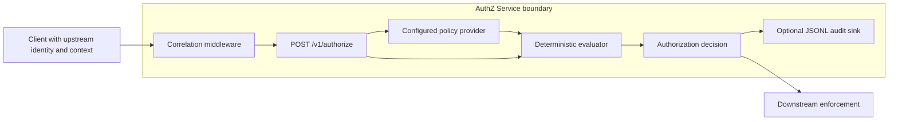

# Architecture and trust boundaries

AuthZ Service evaluates one request against one configured JSON policy. Its
boundary begins after a caller has supplied identity and context and ends when
it returns a decision. Authentication, token validation, and enforcement are
outside that boundary.

## Request path

The correlation middleware accepts a bounded opaque `X-Correlation-Id` or
generates one. `/v1/authorize` validates the request schema, loads the active
policy from `AUTHZ_POLICY_PATH`, and passes the policy and supplied inputs to
the evaluator. The evaluator returns a decision, reason, and matched rule IDs
in policy order. The endpoint adds decision and policy identifiers and then,
when configured, writes an audit record before returning the response.

If `AUTHZ_AUDIT_PATH` is set and the audit write fails, the request fails with
an `audit_write_failed` response. This is fail-closed with respect to returning
an authorization decision without its configured audit record. The JSONL file
is still a local sink: the service does not claim replication, retention,
tamper evidence, or durable storage beyond the configured filesystem.

## Decision semantics

- No matching rule produces `deny` with `deny_by_default`.
- Any matching explicit deny takes precedence over matching allows.
- Otherwise, one or more matching allow rules produce `allow`.
- All matched rule IDs are returned in their configured policy order, making
  evaluation repeatable for the same policy and inputs.
- Matching is exact and conjunctive for action, resource type, subject claims,
  resource attributes, and context claims.

## Trust boundaries

- Upstream systems are responsible for authenticating callers and supplying
  accurate identity, resource, and context attributes.
- Operators are responsible for the content, provenance, and protection of the
  configured policy file.
- Downstream systems are responsible for enforcing the returned decision at
  the action boundary.
- Operators are responsible for the durability, access control, retention, and
  monitoring of the configured audit path.

This service does not authenticate callers, validate or issue tokens, establish
the truth of supplied claims, or enforce the requested action. Its output is
evidence about what the configured policy permits, not assurance that the
identity, context, action, or wider system is trustworthy or safe.
